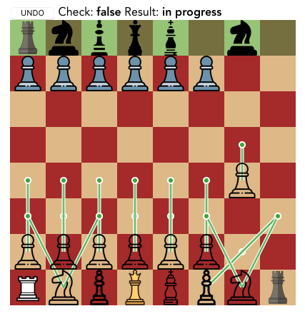

# 🏗️ ♞

An incomplete, buggy implementation of chess.

#### Features

- Turn-based.
- Show valid moves.
- Undo moves.
- Pawn promotion.
- Castling 🏯
- Checks and checkmates.

#### Missing

- Computer opponent; right now you battle yourself, so it's closer to real life than a game.

#### Apologies

I got the icons from the internet but don't remember where. I will resolve this! If you're the artist, I'm sorry 🙏
